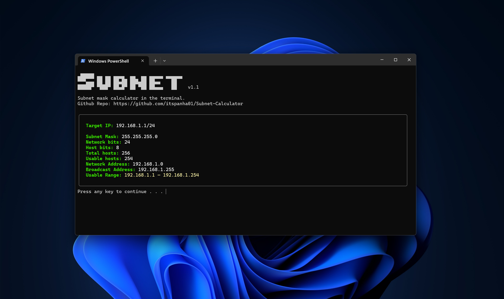

# Subnet Calculator
A Quick and easy subnet calculator right in the terminal.

# Requirments


Runs in any terminal using python.

```powershell
python subnet.py
```
# Features
- Divides Network and Host bits
- Provides the subnet masks
- Checks total hosts
- Checks number of usable hosts
- Calculate the range of usuable IP